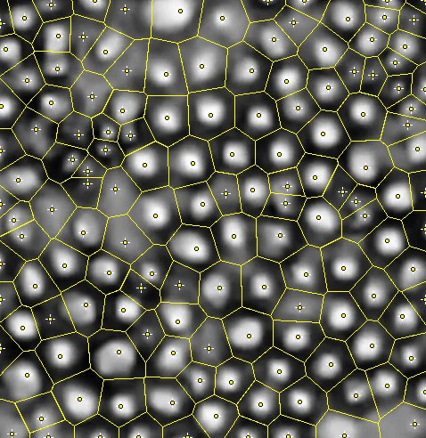

# Microalgae :seedling: :microscope:

> Estudio del movimiento de la microalga Chlorococum sp.

### Acerca de

Dentro del [Laboratorio de Materiales Blandos, Simulación y Cálculo Numérico](https://www.uv.mx/ffia/investigacion/laboratorios-investigacion/laboratorio-materia-blanda/) se obtuvieron diversas grabaciones de la actividad de las microalgas bajo un ambiente controlado. 

----

#### Pre-procesamiento

A través de [Fiji](https://imagej.net/software/fiji/) se extrajeron los fotogramas y se realizó un pre-procesamiento de los datos que consistió en:

- Reducir las imágenes a 8-bits 
- Aplicar un filtro gaussiano para reducir el ruido
- Establecer un umbral y aplicar una máscara binaria para aislar las microalgas

#### Análisis
Posteriormente se calculó el centroide de cada una y se obtuvo le tracking de las posiciones durante toda la grabación.

El análisis estadístico permitió obtener el coeficiente de difusión, i.e, la dinámica asociada a la interacción.

 

